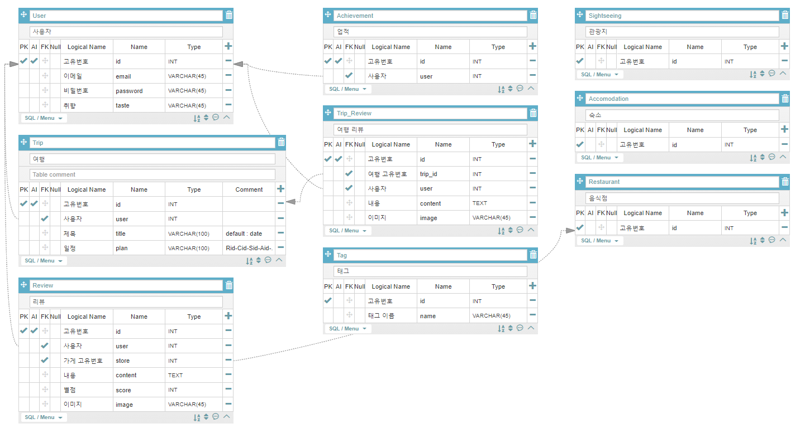
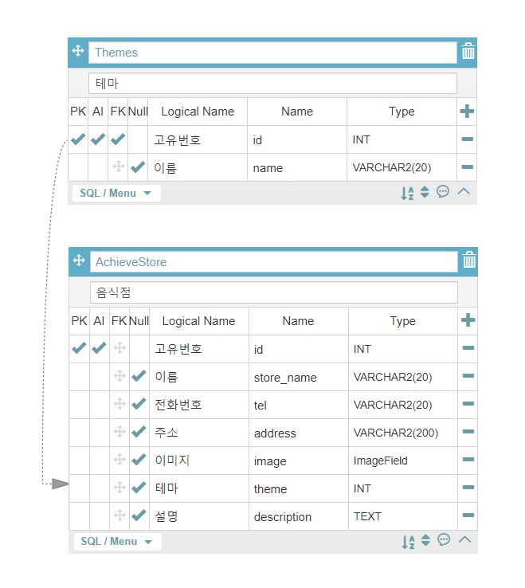
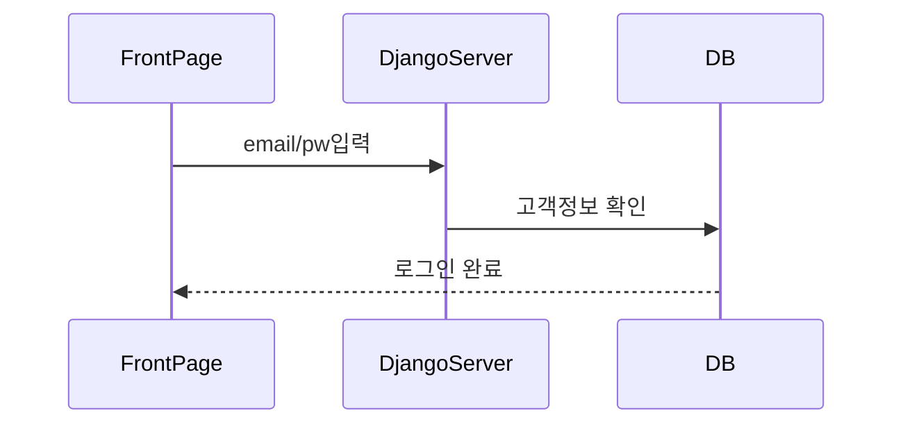
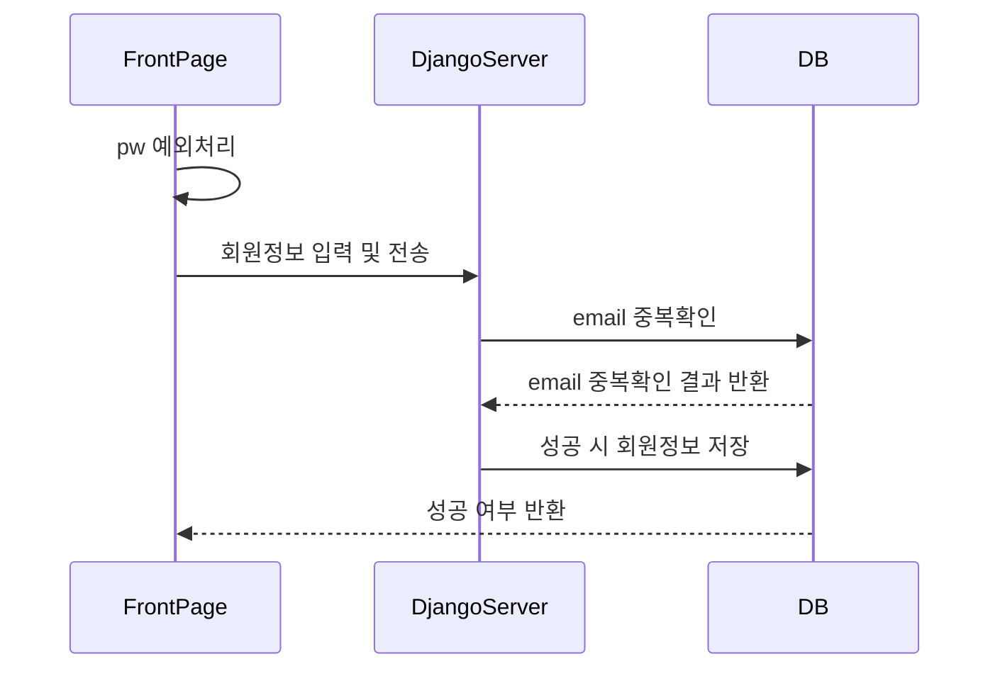
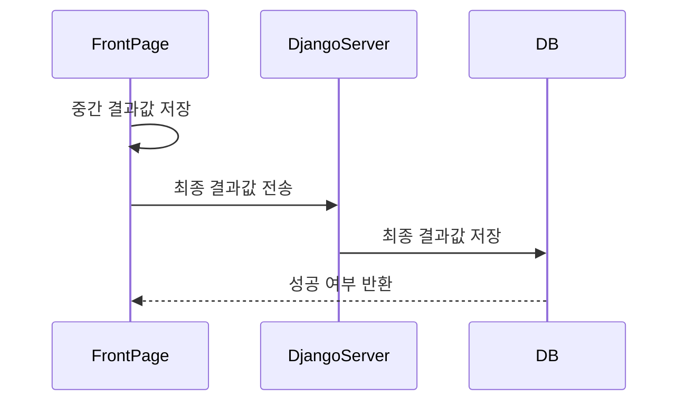
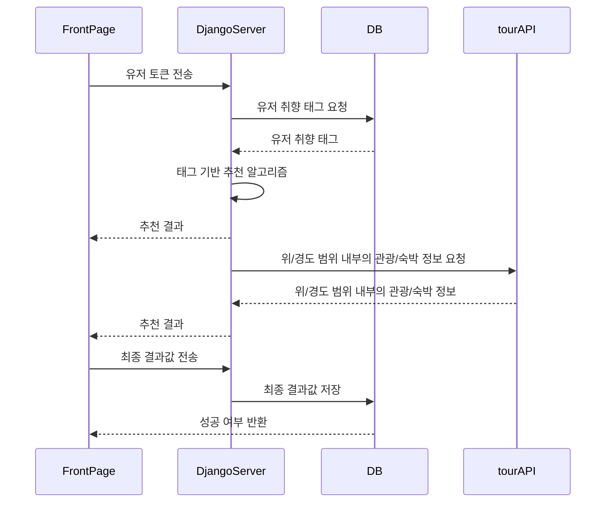
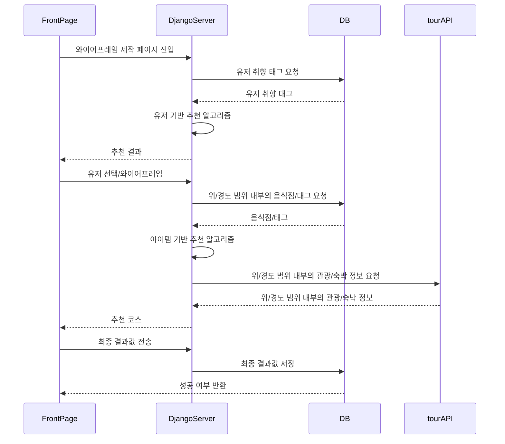
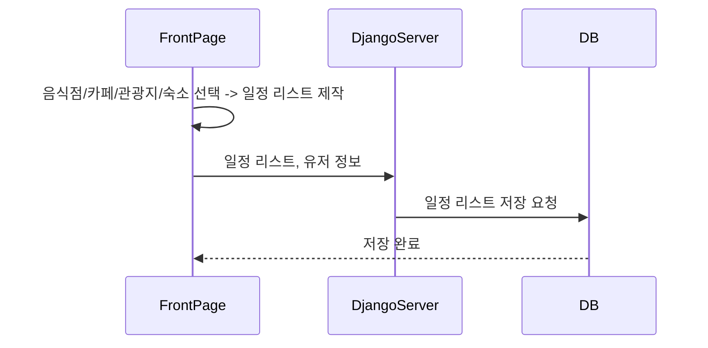
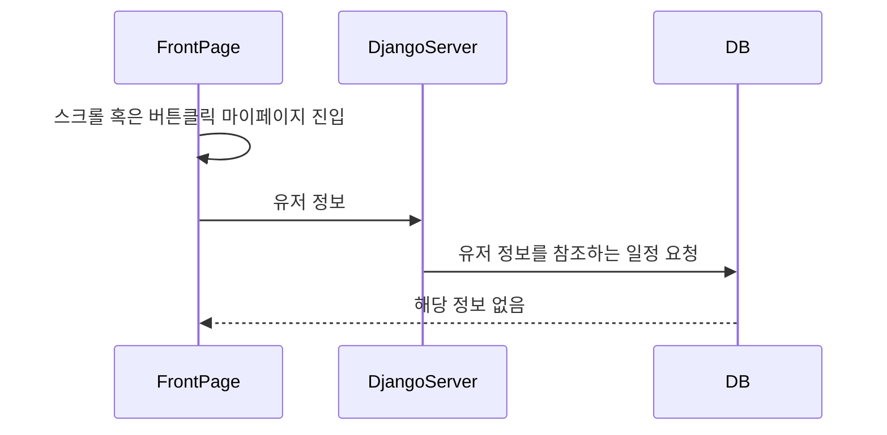
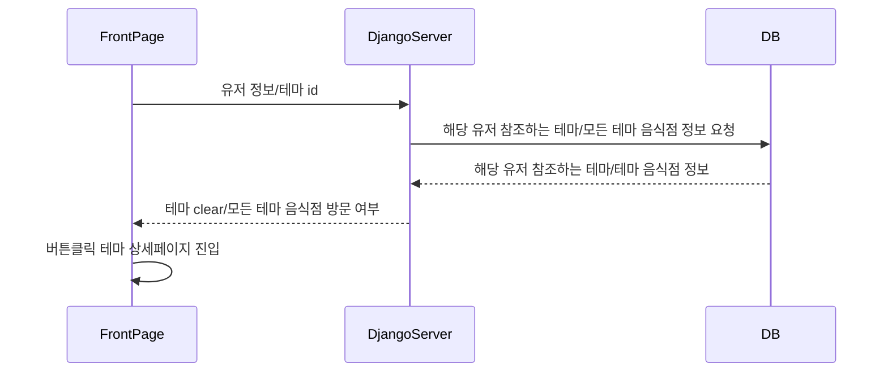

# 식도랑

>  음식점 기반 여행 기획 및 추천 플랫폼
>
> Big data project - Travel planning service with collaborative filtering

- [식도랑_와이어프레임.pdf](README_img/식도랑_와이어프레임.pdf) 
- [식도랑_와이어프레임2.pdf](README_img/식도랑_와이어프레임2.pdf) 

# ERD

### 여행 일정

### 성취(맛집 도장깨기)

# 식도랑 시퀀스

## 1. 로그인

로그인은 email, pw 입력을 통해 DB를 확인하여 로그인을 진행

## 2. 회원가입

별도의 인증 없이 email 중복확인과 pw 예외처리 후 저장한다.

## 3. 취향 월드컵

회원가입 성공 직후 취향 월드컵을 통해 사용자의 취향을 분석하여 user 테이블에 저장

## 4. 사용자 선택코스

사용자가 지도 페이지에 접근하면 사용자의 토큰을 이용하여 DB에서 취향(태그)을 가져와 사용자 지정 장소에서 해당 태그와 겹치는 음식점을 6개 선별하여 프론트로 반환

## 5. 식도랑 추천코스

사용자가 식도랑 추천코스 버튼 클릭 시 사용자의 토큰을 서버에 전달하여 취향(태그)를 기반으로 유저 기반 추천 알고리즘 (협업 필터링)을 이용하여 사용자에게 지역과 음식점을 추천

## 6. 오늘의 일정 선택(와이어프레임)

드래그 앤 드롭 방식으로 사용자가 "음식점 / 카페 / 관광지 / 숙소" 중 선택하여 일정을 계획하도록 유도함

## 7. 마이페이지 (저장된 일정 조회)

메인 페이지에서 스크롤 혹은 버튼 클릭을 통해 마이페이지로 진입 후 사용자 토큰을 통해 여행 일정 정보를 불러와 보여줌

#### 일정이 없을 경우

## 8. 업적 페이지 (음식점 테마 별로 업적 갱신)

메인 페이지에서 테마별 아이콘을 누르면  해당 테마 음식점 (최대 9개)을 소개해준다. 방문한 가게는 clear로 도장깨기가 되고, 그 테마의 모든 음식점을 다 방문하면 메인페이지에서 해당 테마 아이콘에 clear가 찍힌다. 또한 마이페이지에 배찌로 업적이 등록된다.

